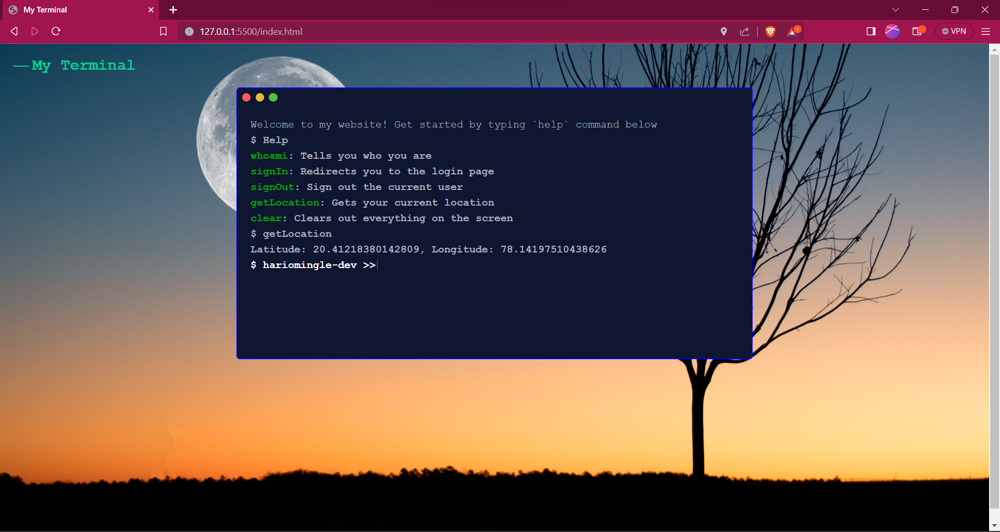

# Interactive-Terminal-
The Interactive Terminal Web App is a modern and stylish web application designed to provide users with an engaging and interactive command-line interface experience. The application features a responsive design, making it accessible on various devices, from desktops to mobile phones.

<a href="https://www.linkedin.com/in/hariom-ingle/">
</img></a>
